# Voitta Desktop — Operations & Data Flow

> A detailed, diagram-first walkthrough of how the app actually works at
> runtime: the process/thread model, the LLM proxy request path and its
> middleware chain, the context-optimizer pipeline, the MCP aggregate proxy
> (mounting, auth injection, resilience, the tool gate), OAuth token
> lifecycle, the Claude link, the UI surfaces, configuration, files on disk,
> and packaging.
>
> Diagrams are [Mermaid](https://mermaid.js.org/). GitHub, VS Code (with the
> Mermaid extension), and most markdown viewers render them inline.

## Contents

1. [System overview](#1-system-overview)
2. [Process & thread model](#2-process--thread-model)
3. [Startup sequence](#3-startup-sequence)
4. [LLM proxy: the request path](#4-llm-proxy-the-request-path)
5. [Middleware: tracker, request logger, cache simulator](#5-middleware-tracker-request-logger-cache-simulator)
6. [The optimizer pipeline](#6-the-optimizer-pipeline)
7. [MCP proxy: aggregation, auth injection, resilience](#7-mcp-proxy-aggregation-auth-injection-resilience)
8. [The tool gate](#8-the-tool-gate)
9. [MCP subprocess lifecycle](#9-mcp-subprocess-lifecycle)
10. [OAuth: sign-in and token refresh](#10-oauth-sign-in-and-token-refresh)
11. [Claude link: wiring ~/.claude/settings.json](#11-claude-link-wiring-claudesettingsjson)
12. [UI surfaces](#12-ui-surfaces)
13. [Configuration: apps.json](#13-configuration-appsjson)
14. [Ports, paths & logging](#14-ports-paths--logging)
15. [Packaging & release](#15-packaging--release)
16. [Appendix: known issues](#16-appendix-known-issues)

---

## 1. System overview

Voitta Desktop is a macOS menu-bar app ([ui/menu.py](../ui/menu.py), `rumps`)
that fuses **two independent local proxies** into one process:

- the **LLM proxy** (`127.0.0.1:18900`, [proxy/server.py](../proxy/server.py))
  — a transparent aiohttp reverse proxy in front of `api.anthropic.com`.
  Claude Code is pointed at it via `ANTHROPIC_BASE_URL`. Every request runs
  through a middleware chain that logs, tracks conversations, **optimizes
  context** (strips stale tool results, images, thinking blocks; compresses
  bash output) and simulates prompt-cache behavior.
- the **MCP proxy** (`127.0.0.1:18765/mcp`,
  [mcpproxy/server.py](../mcpproxy/server.py)) — a FastMCP aggregate server
  that mounts N backend MCP servers (HTTP, managed subprocesses, stdio) under
  tool-name prefixes, injecting live OAuth tokens into backends that need
  them.

The two proxies share one piece of state: optimizers replace stripped
content with `get_vt_object(hash=…)` references, and the MCP proxy serves
that built-in tool, so the model can recover anything the optimizer removed.

A `--terminal` flag swaps the macOS shell for a Textual TUI
([ui/tui/app.py](../ui/tui/app.py)); both shells share the same core
([app_base.py](../app_base.py)).

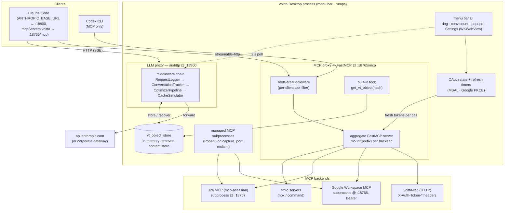

**Key invariants:**

- Both proxies bind **loopback only**; nothing is reachable from the network.
- The LLM proxy is **transparent to credentials** — `x-api-key` /
  `authorization` pass through to the upstream untouched (and are stripped
  from all logs).
- Optimizer rewrites are **deterministic** (stable hash-based placeholders),
  so a re-sent conversation prefix stays byte-identical and Anthropic's
  prompt cache is not invalidated. The last `keep_turns` user turns are never
  touched.
- Anything the optimizer removes is **recoverable**: the placeholder text
  tells the model to call `get_vt_object(hash=…)` on the MCP proxy, which
  serves the original from `vt_object_store`. (In-memory only — see
  [§16](#16-appendix-known-issues).)
- Backend MCP auth is resolved **per upstream call** (fresh `ProxyClient`
  from a factory closure), so token refreshes propagate without remounting.
- Tool listings are served from a **disk cache, stale-while-revalidate** —
  a dead backend never blocks a client's `tools/list`.

---

## 2. Process & thread model

Everything runs in **one process**, across **two concurrency contexts**.
That is the whole model — there is no third place for work to happen.

| Context | What runs on it |
|---|---|
| **AppKit main thread** | rumps/AppKit run loop (Mac) or Textual (TUI); every menu, window and status-item mutation; `@rumps.timer` callbacks |
| **The runtime** ([runtime.py](../runtime.py)) | one asyncio loop on one thread — LLM proxy, MCP proxy, token-refresh timers, OAuth callback, request watchdog — plus a small bounded pool for blocking calls (MSAL, `requests`, subprocess probes) |

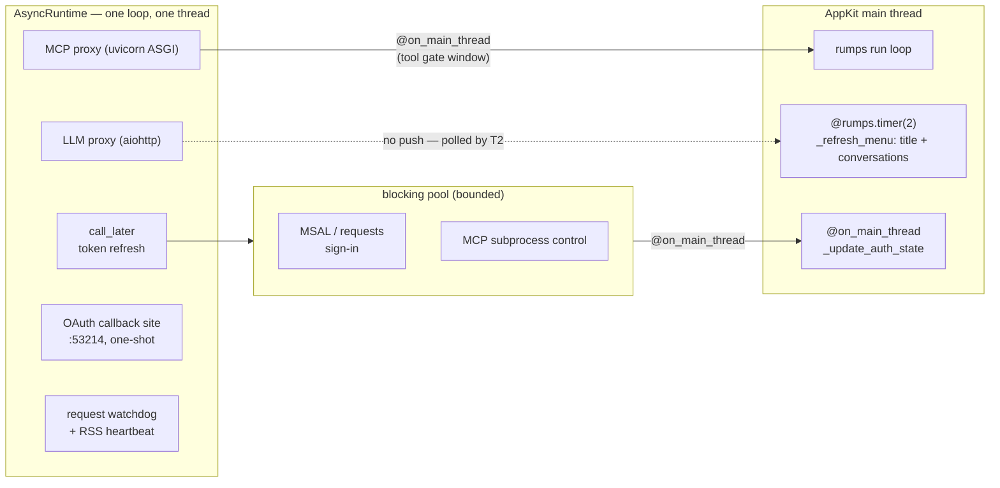

### Why it is shaped this way

There used to be **four event loops and nine ad-hoc threads**: a loop for
the LLM proxy, another created inside the menu, a third inside the settings
window, a fourth owned by FastMCP's blocking `run()`, plus a
`threading.Timer` per OAuth token, a blocking `HTTPServer` for the OAuth
redirect, a watchdog thread, and a fresh `threading.Thread` per settings
click. Nothing coordinated them, so "which loop is this on?" and "is this
attribute safe to touch from here?" had to be re-answered by hand at every
call site. Wrong answers surfaced as intermittent, unattributable failures.

Two mechanical changes collapsed that:

- `FastMCP.run()` creates and owns a loop, which is why the MCP proxy needed
  a thread. `run_http_async()` is the same server without that — it awaits
  on whatever loop is already running, so it shares ours.
- `threading.Thread(target=...)` became `runtime.run_blocking(...)`: bounded,
  named, and with failures logged rather than silently killing an anonymous
  thread.

### The main-thread rule

AppKit objects must be touched **only** on the main thread; violating that
gives `EXC_BAD_ACCESS` — a hard crash with no Python traceback. That rule
used to be enforced by remembering to write `AppHelper.callAfter` at each of
eight scattered call sites, and a rule with no enforcement is one that
eventually gets missed.

It is now a single decorator, [`@on_main_thread`](../ui/main_thread.py).
Called from the main thread it runs inline and returns normally; called from
anywhere else it queues via `callAfter` and returns `None` — so never use it
for a value the caller needs.

The tracker never pushes to the Mac UI: `notify_update()` is a no-op and the
menu **polls** every 2 s. The TUI instead receives a posted
`ConversationsUpdated` message.

### Shutdown

`runtime.shutdown()` is registered with `atexit`: it stops the loop, drains
and cancels pending tasks, and shuts the pool down. Because orphaned MCP
subprocesses on the next boot are the tell-tale that `atexit` never ran, a
clean quit and a hard kill are now distinguishable — see
[§14](#14-ports-paths--logging).

---

## 3. Startup sequence

Entry point is [app.py](../app.py) (`python app.py` in dev; the packaged
bundle imports the same `main()` via
[src/voitta_desktop/\_\_main\_\_.py](../src/voitta_desktop/__main__.py)).

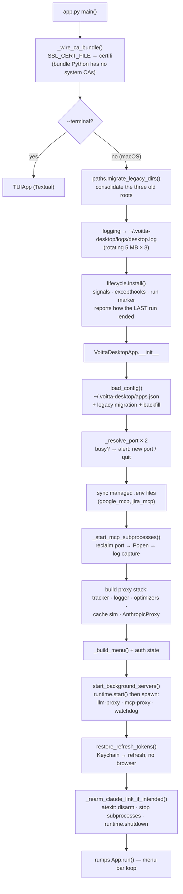

Port conflicts get an interactive alert (usually a stale previous instance);
choosing "Use another port" grabs an OS-assigned one **for this session
only** — it is deliberately not persisted, so the underlying conflict stays
visible. The TUI resolves silently instead.

---

## 4. LLM proxy: the request path

[proxy/server.py](../proxy/server.py) — `AnthropicProxy`. One
`aiohttp.ClientSession` (20-connection pool, `sock_read=600`,
`auto_decompress=False`) and a catch-all route: every method, every path.

### Middleware contract

Middleware ([middleware/base.py](../middleware/base.py)) implement any of
four hooks; the proxy calls them in stack order (reverse order for response
hooks does **not** apply — all hooks run in list order):

| Hook | When | Can it mutate? |
|---|---|---|
| `on_request(req) → req` | after full body read, before upstream | yes — body, headers |
| `on_response_started(req, resp) → resp` | upstream status/headers in | yes |
| `on_response_chunk(req, chunk) → chunk` | every SSE chunk | yes |
| `on_response_done(req, resp)` | terminal — **always runs** | observe only |

The stack, built in [app_base.py](../app_base.py):
**RequestLogger → ConversationTracker → OptimizerPipeline → CacheSimulator**.

### One request, end to end

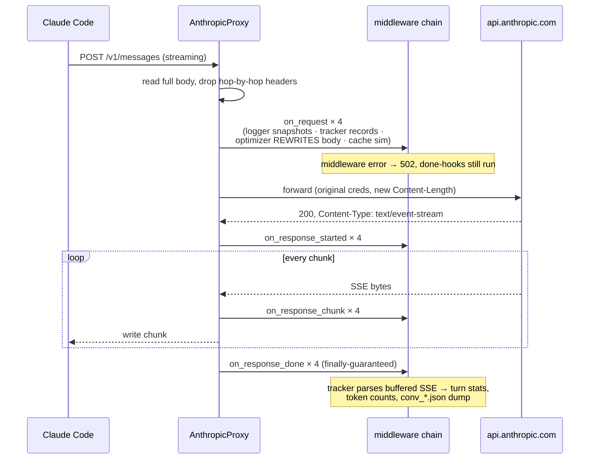

Two response modes, split on `Content-Type`:

- **`_stream_response`** — SSE: chunks are forwarded as they arrive, each
  passing through `on_response_chunk`. Client disconnects and read timeouts
  are absorbed; `write_eof` always runs.
- **`_buffered_response`** — everything else. On status ≥ 400 for
  `/v1/messages`, `_dump_failure` writes the **post-optimization** request
  body plus the upstream error to `~/.voitta-desktop/logs/fail_<status>_<ts>.json`
  (credentials stripped) — exactly what the upstream rejected, for debugging
  optimizer-induced 400s.

`on_response_done` runs for every middleware whose `on_request` ran, even
when the path bailed early (middleware error, upstream connect failure,
client disconnect) — a synthetic 502 `ProxyResponse` is passed in that case.
Without this guarantee, `RequestLogger`'s in-flight table leaked entries and
the watchdog reported them as stale indefinitely.

---

## 5. Middleware: tracker, request logger, cache simulator

### ConversationTracker ([middleware/tracker.py](../middleware/tracker.py))

Identity = the `X-Claude-Code-Session-Id` header (title-probe requests with
`max_tokens == 1` are ignored). On every completed `/v1/messages` response it
re-derives the conversation from the request body:

- `parse_turns()` groups messages into human-input turns; per-turn char
  counts by kind (user text, assistant, tool calls/results, bash, images,
  thinking) feed the chart popup.
- file operations (Read/Write/Edit) are extracted from tool calls and
  attributed to the turn holding the matching `tool_result`.
- the buffered SSE stream is parsed for real token usage
  (`message_start`/`message_delta`), accumulated per conversation.
- every turn ends with a debug dump to
  `~/.voitta-desktop/logs/conv_<session>.json` and a one-line
  `tokens | in=… out=… cache_read=…` INFO log.

### RequestLogger ([middleware/logger.py](../middleware/logger.py))

One JSONL file per day: `~/.voitta-desktop/logs/YYYY-MM-DD.jsonl`, **wiped on
every app start** (`*.jsonl` only — `desktop.log` survives). Bodies are
trimmed: last 2 messages kept + `[N omitted]` placeholder, tools reduced to a
name list, strings truncated at 2000 chars, credentials removed. A watchdog
task on the shared runtime warns when a request has been in flight > 60 s,
and doubles as the RSS heartbeat (see [§14](#14-ports-paths--logging)).

### CacheSimulator ([middleware/cache_sim.py](../middleware/cache_sim.py))

Observation only — it never modifies the request. It rebuilds Anthropic's
block sequence (tools → system → messages) per request and diffs it against
the previous request of the same session to count the identical leading
prefix — i.e. what the prompt cache *would* serve. Volatile values
(`cache_control` markers, `cch=<hash>` context lines) are normalized out
before comparing. Produces per-turn `cached_ratio` + first-divergence
location (`boundary_section/index`), which the conversation chart renders;
this is the main tool for spotting cache-invalidating request mutations.

---

## 6. The optimizer pipeline

[optimizers/](../optimizers/__init__.py). `OptimizerPipeline.on_request`
rewrites the request body **in flight**; Claude Code keeps its full local
transcript and is unaffected.

### Order and roles

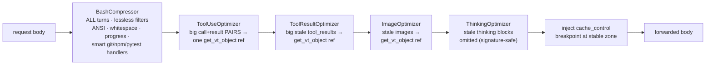

Order matters twice: **BashCompressor first** so later optimizers see
already-compressed bash output (no double counting); **ToolUse before
ToolResult** so a long-call/long-response pair collapses once, not twice.

### `keep_turns`: the stability window

Every turn-aware optimizer takes `keep_turns` (default 5, configurable per
optimizer in the `time` config block). "Turns" = **human-input** user
messages (tool_result-only messages don't count).

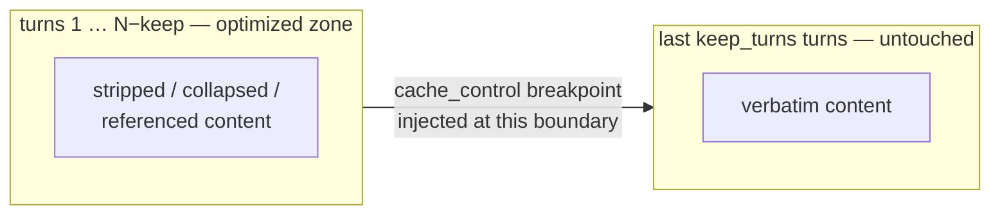

Because replacements are deterministic, the optimized zone is byte-stable
across successive requests — an append-only prefix. The pipeline injects an
`ephemeral` `cache_control` breakpoint one turn before the smallest non-zero
threshold, marking the guaranteed-stable prefix for Anthropic's cache (TTL
selection respects the API rule that a `1h` block may not follow a `5m` one).

Before and after the pipeline, `validate_tool_pairing` checks for orphaned
`tool_use`/`tool_result` pairs; a problem the pipeline *introduced* logs
`OPTIMIZER BROKE TOOL PAIRING` (the usual cause of upstream 400s — see the
`fail_*.json` dumps).

### Recovery: `vt_object_store` + `get_vt_object`

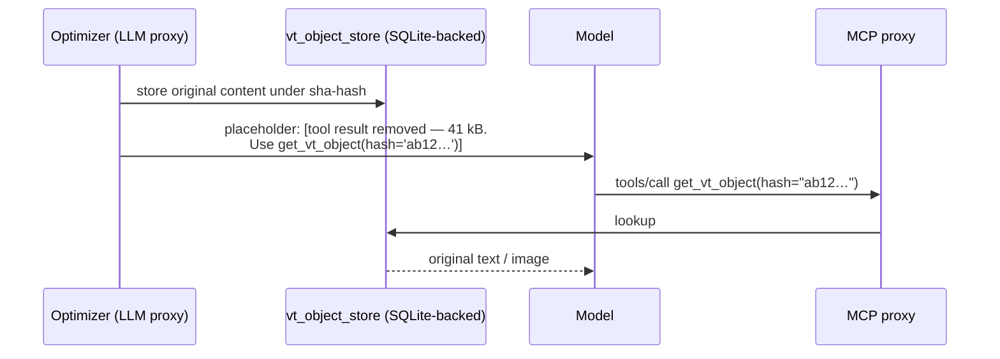

The store is shared by both proxies — same process, no IPC — and is backed
by SQLite at `~/.voitta-desktop/state/objects.db`
([optimizers/object_store.py](../optimizers/object_store.py)).

Persistence is not an optimisation here, it is correctness. The placeholders
live in the conversation transcript, which outlives the process; when the
store was a bare in-memory dict, every restart silently orphaned every
reference already in flight, and the model would ask for a hash and be told
it did not exist.

It subclasses `dict`, so the optimizers' `store[h] = obj` and `store.get(h)`
are unchanged. Writes go through to disk; reads fall back to disk on a miss
and promote the row into memory, so RAM holds only what this session touched
rather than the entire history. A 512 MB budget evicts least-recently-read
rows — images dominate. If the database cannot be opened the store degrades
to memory-only and logs it, rather than taking the optimizers down.

### Savings accounting

`tokens_saved` accrues per model family and is priced at **cache-read rates**
(opus $1.50 / sonnet $0.30 / haiku $0.08 per Mtok), because in steady state
the stripped tokens would have been served as cache reads. The total shows in
Settings → Info and the TUI. A `haiku_only` config flag restricts the whole
pipeline to Haiku-model requests (cheap experimentation mode).

---

## 7. MCP proxy: aggregation, auth injection, resilience

[mcpproxy/server.py](../mcpproxy/server.py) `build_mcp_proxy` assembles one
FastMCP aggregate server and mounts each configured backend under its
`prefix`:

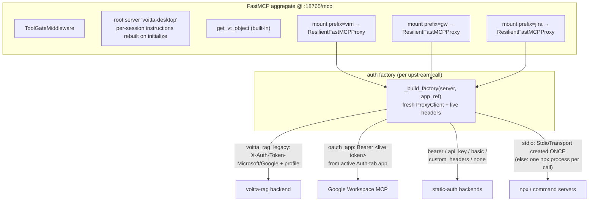

A tool named `search` on a backend with `prefix: "vim"` is exposed as
`vim_search`. Mounted proxies are exported as `app_ref._mcp_backends` for
the status popups. Two deliberate root-server tweaks:

- **`tools/list_changed` notifications are disabled** — Claude Code re-fetches
  the tool list on every notification, which would re-trigger the tool gate.
- **`instructions` are rebuilt per MCP session**, describing only backends
  that currently have ≥ 1 enabled tool (upstream instruction text is fetched
  once in the background and cached).

### Resilience: stale-while-revalidate listings

`ResilientFastMCPProxy` ([mcpproxy/resilient.py](../mcpproxy/resilient.py))
keeps an unreachable backend from blocking or erroring client requests:

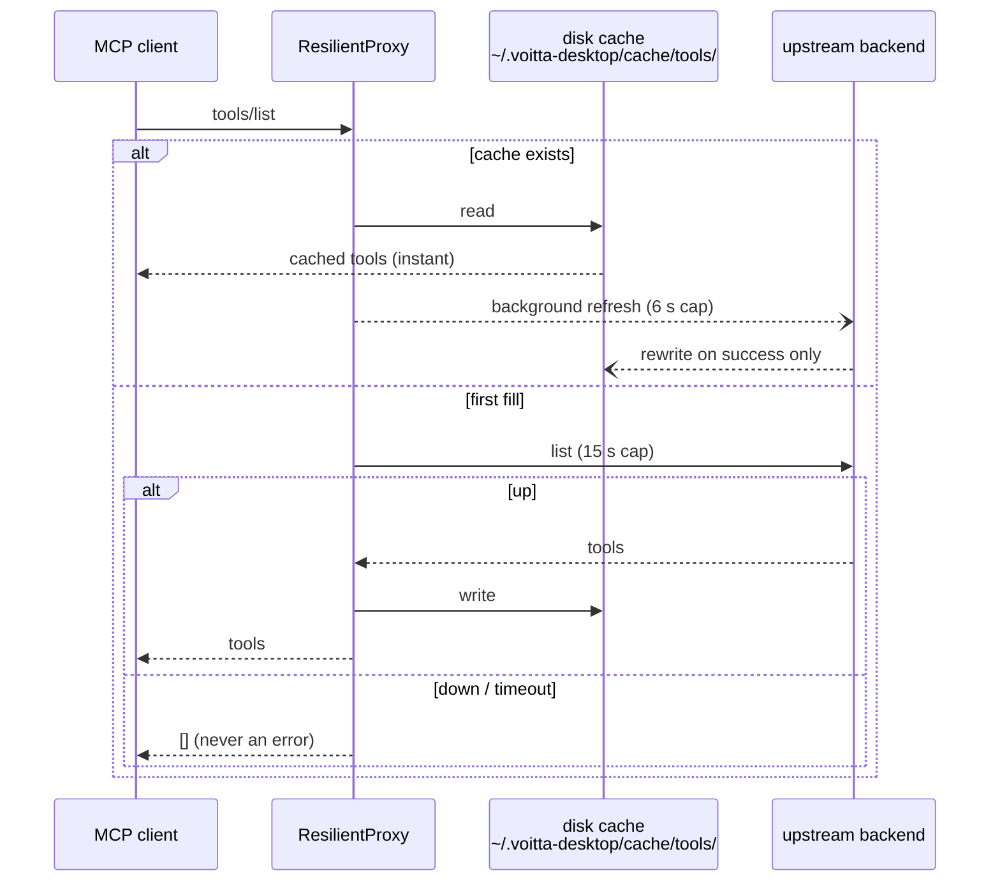

- Upstream failures **never propagate** — cache or `[]`, and repeat warnings
  for the same backend are throttled to one per hour (an expired token would
  otherwise log a 401 per menu poll).
- `force_refresh()` (menu "LLM Tools Status" / Settings) bypasses the cache
  with a 30 s budget; it records `_last_refresh_error` per backend, which the
  Settings Info tab surfaces as ok / empty / error per backend.
- `peek_cached()` gives the Settings UI synchronous, loop-free reads.
- Backends that don't advertise `prompts`/`resources` capabilities in their
  initialize handshake are never asked for them (`_ensure_caps` does a
  one-shot handshake and caches the result) — avoids error spam from
  tools-only servers.

---

## 8. The tool gate

`ToolGateMiddleware` intercepts every `tools/list` on the MCP proxy and
decides what that particular client sees:

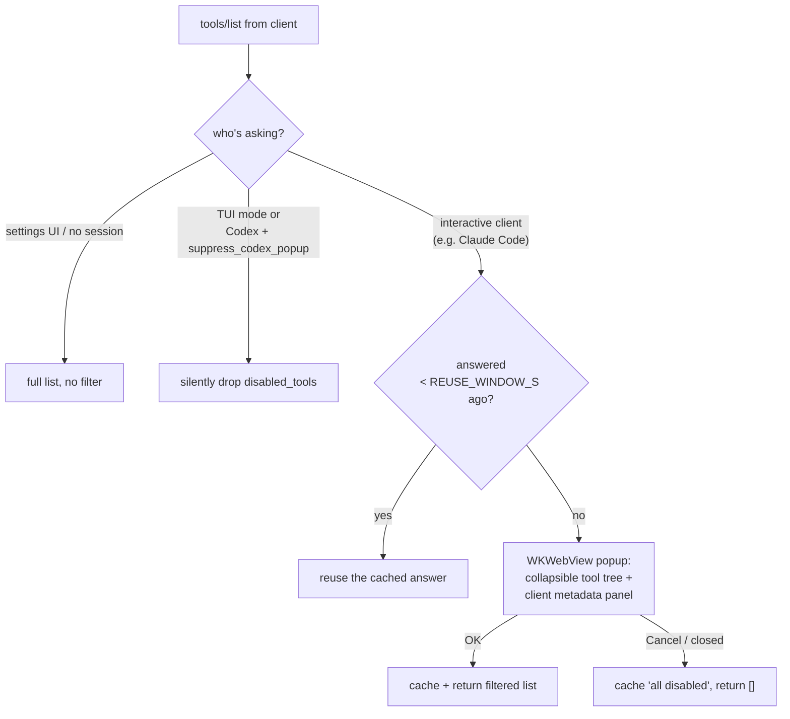

The popup ([ui/tool_gate.py](../ui/tool_gate.py)) is opened from the MCP
proxy via `@on_main_thread` and awaited on an `asyncio.Event`; the webview
communicates back by setting `document.title` to `GATE_OK`/`GATE_CANCEL`
(the same title-KVO bridge the Settings window uses — see
[§12](#12-ui-surfaces)).

### The popup deliberately outlives the request that opened it

An MCP client times out a `tools/list` in about **five seconds**. No human
reads a tool list and clicks in five seconds, so in practice the request is
**always** cancelled before the answer arrives. Two consequences are wired
into the design, and both are load-bearing:

**1. The cancellation must escape.** When the client gives up it sends
`notifications/cancelled`; the SDK calls `RequestResponder.cancel()`, which
has *already sent an error response* and set `_completed`. The SDK's guard
against responding twice lives inside
`except get_cancelled_exc_class()` in `mcp/server/lowlevel/server.py` — so
it only fires if `CancelledError` propagates out of our handler.

`show_tool_gate` used to catch `(CancelledError, Exception)` and return
`None`. The handler therefore returned a normal value, the SDK fell through
to a second `respond()`, tripped `assert not self._completed`, and that
`AssertionError` escaped into the anyio TaskGroup and **destroyed the entire
streamable-http session**. Both `show_tool_gate` and `_show_gate` now
re-raise. Regression tests:
[tests/test_tool_gate_cancellation.py](../tests/test_tool_gate_cancellation.py).

**2. The window stays open and publishes anyway.** Tearing it down on
cancellation would just re-prompt on the retry, forever. Instead the popup
survives, and when the user finally clicks, the answer goes to the
middleware through the `on_result` callback — *not* the return value — and
lands in the cache. The client's retry hits `REUSE_WINDOW_S` and is served
with no second popup. A retry that arrives while the popup is still up
attaches to it rather than stacking a second window.

`REUSE_WINDOW_S` is therefore minutes, not seconds: it has to outlast a
human reading a tool list. `rearm()` clears the cached answer to force a
fresh prompt.

---

## 9. MCP subprocess lifecycle

[ui/mcp_lifecycle.py](../ui/mcp_lifecycle.py). Backends with
`kind: subprocess` and an HTTP template are **owned** by Voitta: it launches
them, captures their output, and can start/stop/restart them live from the
Settings UI (the proxy reconnects per call, so no remount is needed).

| Template | What launches | Port conveyance |
|---|---|---|
| `google_mcp` | `uv run main.py --transport streamable-http` in `cwd` | `PORT` env |
| `jira_mcp` | `uvx mcp-atlassian --transport streamable-http --port N --env-file …` | argv |
| `http_command` | arbitrary user argv | `{port}` / `{env_path}` tokens or `port_env` |
| `npx` / `command` | *nothing here* — stdio, owned by fastmcp ([§7](#7-mcp-proxy-aggregation-auth-injection-resilience)) | — |

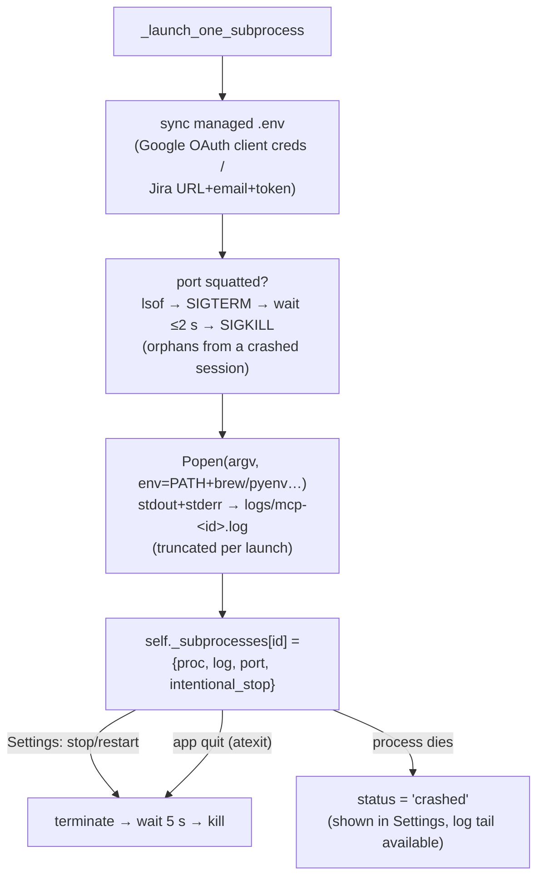

The port-reclaim step exists because `atexit` doesn't run on
crash/force-quit, so a previous session's subprocess can survive and keep
its port bound; those ports are dedicated to Voitta-managed servers, so any
listener is treated as an orphan from a previous session. The subprocess `PATH` is extended
with Homebrew / pyenv shims / cargo because a GUI-launched bundle inherits
launchd's minimal environment.

---

## 10. OAuth: sign-in and token refresh

[auth/providers.py](../auth/providers.py),
[auth/callback.py](../auth/callback.py),
[ui/auth_flows.py](../ui/auth_flows.py). Auth state lives in
`self._auth[(app_id, backend)]` — token, refresh token, profile, timer —
and is **memory-only**: a restart signs everyone out.

### Interactive sign-in (menu click)

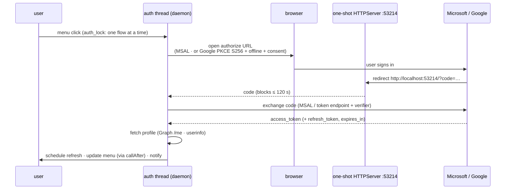

Scopes are per (app type, backend): Microsoft RAG needs only `User.Read`;
Google Workspace adds Sheets/Docs/Slides/Drive.

### Refresh timers

Each token gets a `runtime.call_later` task scheduled at `expires_in − 300 s`
(a `threading.Timer` per token, before the runtime existed; the returned
future keeps the same `.cancel()` interface). The failure handling
distinguishes a network error from a rejected refresh token:

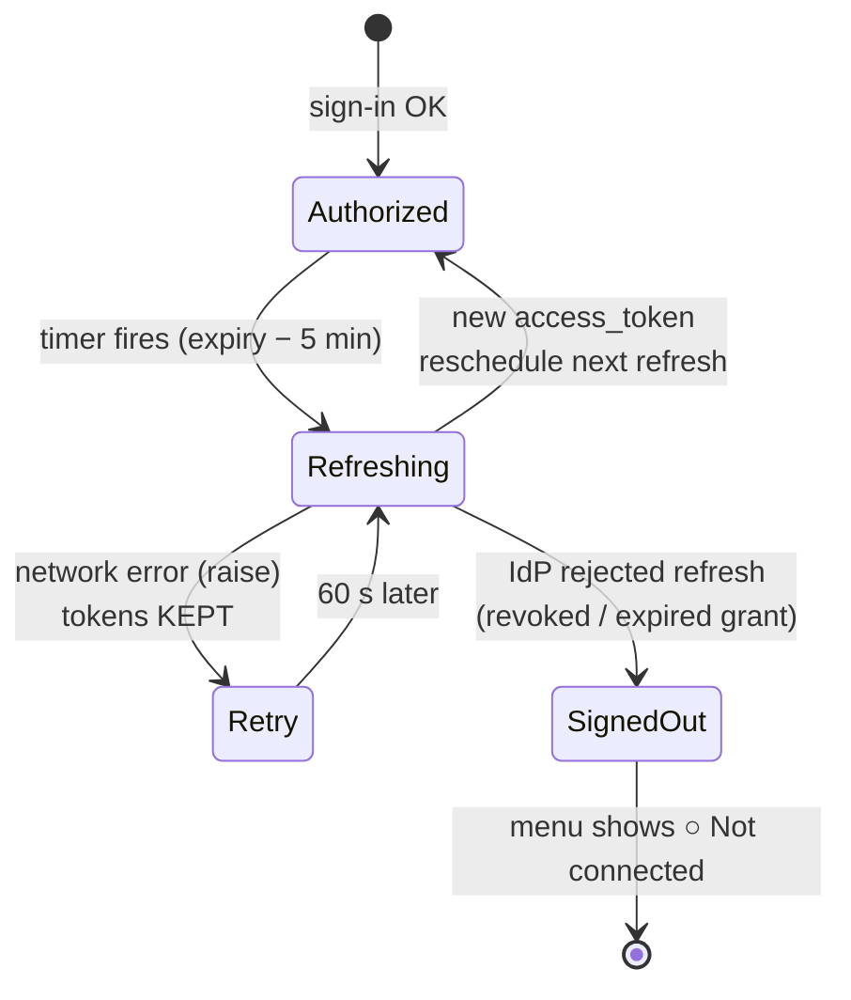

`do_refresh_google` returns `None` only on an explicit server rejection;
network errors propagate as exceptions, and both refresh handlers catch them
and reschedule a 60-second retry with tokens intact. (Earlier versions
treated a network error the same as a rejection, so a brief outage signed
the user out.)

Tokens flow to backends at MCP-call time via the auth factories
([§7](#7-mcp-proxy-aggregation-auth-injection-resilience)) — nothing is
pushed on refresh.

### Sign-ins survive a restart

Refresh tokens are stored in the **macOS Keychain**
([auth/token_store.py](../auth/token_store.py), service
`ai.voitta.voitta-desktop`). Access tokens are short-lived and deliberately
not persisted, so `restore_refresh_tokens()` at startup reloads each refresh
token and schedules an immediate refresh — that first refresh is what brings
each app back online. Without this the app forgot every sign-in on every
launch and demanded a fresh browser round-trip per connected app.

The Keychain rather than a file in our own tree: these are long-lived
credentials for the user's Google and Microsoft accounts, and `security(1)`
is always present with nothing to bundle. Every operation degrades to a
no-op if the Keychain is unavailable, costing a re-login and nothing worse.

The OAuth redirect listener ([auth/callback.py](../auth/callback.py)) is now
a one-shot aiohttp site on the shared runtime rather than a blocking
`HTTPServer` holding a thread for up to two minutes. The **port is
unchanged** — it appears in the redirect URI registered with Google and
Microsoft, so moving it would mean editing those app registrations.

---

## 11. Claude link: wiring ~/.claude/settings.json

[claude_link.py](../claude_link.py) reversibly points Claude Code at the LLM
proxy by editing the `env` block of `~/.claude/settings.json` (everything
else in the file is preserved verbatim; changes go through explicit
`plan_connect`/`plan_disconnect` diffs that the UI shows before applying).

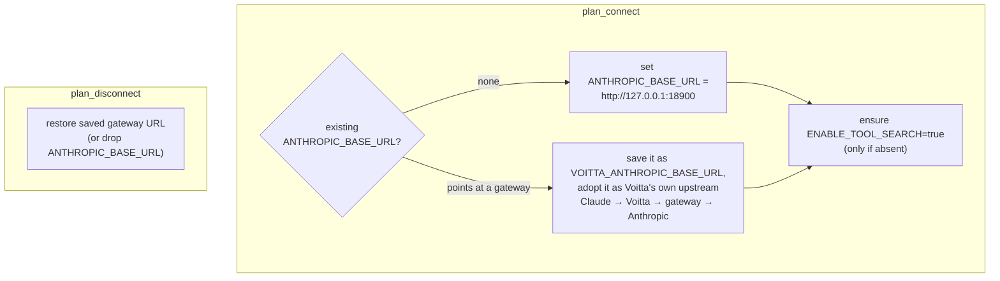

Enforcement is intent-based (`claude_link.armed` in apps.json):

- **startup** — if armed and not already wired, re-apply the connect plan;
- **quit** — `atexit` (which rumps also fires on Cmd-Q) always strips Voitta
  from settings.json, armed or not, so a crashed session leaves at most one
  stale link that the next start reconciles.

MCP wiring (`mcpServers.voitta` in `~/.claude.json` / settings.json, and
`[mcp_servers.voitta]` in `~/.codex/config.toml`) is **detected and shown**
in the Settings Info diagram but registered by the user/CLI, not written by
the app.

---

## 12. UI surfaces

### Menu bar

The status item is drawn as one attributed string every 2 s: the number of
live conversations and the dog icon (inline `NSTextAttachment`), nothing
else. The count dims to 40 % opacity when the LLM proxy isn't
running. The dropdown shows auth per provider (● / ○ + account), proxy
endpoints, the optimizer toggle, and one row per live conversation
(`label [tokens cache:N%] ×turns`).

### Conversation chart popup

Clicking a conversation opens a floating WKWebView
([ui/conv_menu.py](../ui/conv_menu.py), [ui/chart.py](../ui/chart.py),
[ui/chart_template.html](../ui/chart_template.html)): per-turn stacked bars
(user / assistant / tool calls / tool results / bash / images / thinking),
overlays for what the optimizer stripped, image thumbnails, file ops, token
usage, and the cache simulator's per-turn hit ratio.

### Settings window & the title bridge

[ui/settings_window.py](../ui/settings_window.py) hosts `settings.html/.js`
in a WKWebView. There is no JS↔native message handler; the bridge works
through the webview's `title` property:

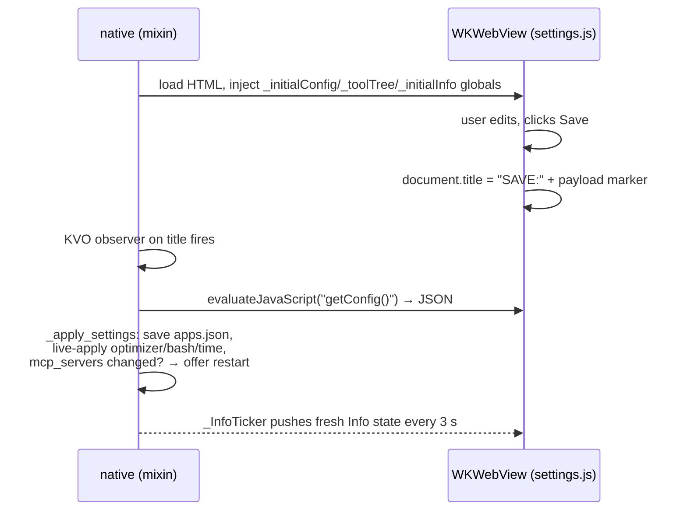

MCP-server list changes require a restart (the aggregate is mounted once);
the restart helper execs in dev and spawns a wait-then-`open` shell in the
bundle. Everything else (optimizer flags, bash filters, keep_turns, Jira
creds) applies live.

### Terminal mode

`--terminal` boots the same `AppBase` core under Textual: same proxies,
optimizers, config. Differences: subprocess MCPs are skipped, the tool gate
filters silently (no popup), OAuth is unavailable, and conversations render
as braille bar charts. Runs on Linux.

---

## 13. Configuration: apps.json

`~/.voitta-desktop/apps.json` ([config.py](../config.py)). `load_config()`
migrates legacy shapes (`proxy` → `mcp_proxy`, `mcp_subprocess` →
`mcp_servers`, `~/.voitta_auth*`) and deep-backfills missing keys from
defaults — saved values always win.

| Block | Keys | Consumed by |
|---|---|---|
| `apps` | OAuth app defs: `id, name, type: microsoft\|google, tenant_id, client_id, client_secret, use_for: [rag, google_workspace]` | auth flows, MCP auth factories |
| `mcp_servers` | per backend: `id, name, prefix, kind: http\|subprocess, url, subprocess{template, cwd, env_path, port, command…}, auth{type, …}` | MCP proxy mounts, subprocess lifecycle, Settings |
| `llm_proxy` | `port` (18900), `upstream_url` | AnthropicProxy |
| `mcp_proxy` | `port` (18765) | MCP proxy |
| `oauth` | `redirect_port` (53214) | callback server |
| `jira` | `server_url, email, api_token, project` | jira.env sync, menu |
| `claude_link` | `armed` | arm/disarm lifecycle |
| `optimizer` | `enabled, haiku_only` | pipeline |
| `bash` | `strip_ansi, trim_whitespace, strip_progress, smart_commands, tool_use_ref_min_chars` | BashCompressor, ToolUseOptimizer |
| `time` | `tool_result_keep_turns, image_keep_turns, thinking_keep_turns` (5 each) | turn-aware optimizers |
| `tools` | `suppress_codex_popup` | tool gate |
| `disabled_tools` | flat list of `prefix_tool` names | tool gate |

Auth types for backends: `none`, `bearer`, `api_key`, `basic`,
`custom_headers` (static) and `oauth_app`, `voitta_rag_legacy` (live tokens
from the auth state).

---

## 14. Ports, paths & logging

### Ports (all loopback)

| Port | What |
|---|---|
| 18900 | LLM proxy |
| 18765 | MCP proxy (`/mcp`) |
| 18766 | Google Workspace MCP subprocess |
| 18767 | Jira MCP subprocess |
| 53214 | OAuth redirect callback (one-shot) |
| others | per-backend defaults in config (e.g. FreeCAD 50005) |

### Directories

Everything lives under **one** root, `~/.voitta-desktop/`, resolved once in
[paths.py](../paths.py). Set `VOITTA_DESKTOP_HOME` to relocate the whole
tree (the test suite does).

| Path | Contents |
|---|---|
| `~/.voitta-desktop/apps.json` | config |
| `~/.voitta-desktop/logs/` | `desktop.log`, request JSONL, conversation dumps |
| `~/.voitta-desktop/state/` | `objects.db` (object store), `last_run.json` (exit marker) |
| `~/.voitta-desktop/cache/tools/` | per-backend MCP listing caches |

Before consolidation this was three unrelated roots with two spellings of
the same name — `~/.voitta_desktop` (config), `~/.voitta-desktop` (logs) and
`~/.voitta_desktop_cache` (tool cache). `migrate_legacy_dirs()` copies the
old locations forward on startup. It **copies rather than moves** and never
overwrites an existing target, so downgrading to an older build still finds
its config where it expects it.

### Knowing why the app exited

A clean quit and a hard kill used to look identical in the log: no
traceback, no shutdown line, just a gap. [lifecycle.py](../lifecycle.py)
closes that with two mechanisms, because they cover different failures.

*Handlers* — signal, `sys.excepthook`, `threading.excepthook` and the
asyncio exception handler — log before the process goes away. They cover
everything the process can observe about its own death.

*A run marker* (`state/last_run.json`) is rewritten on start, on heartbeat
and on exit. If a run starts and finds the previous marker still in state
`running`, the previous process died without executing **any** handler:
SIGKILL, a jetsam (out-of-memory) kill, or a panic. Nothing in-process can
observe those, so the marker is the only way to see them. It carries the
last known peak RSS, which is what separates an OOM kill from the rest.

```
CRITICAL: PREVIOUS RUN DIED SILENTLY — no signal, no exception, no clean
exit. pid=73820 last_seen=2026-08-08 12:38:10 peak_rss=17.3 MB. This is
SIGKILL, an out-of-memory (jetsam) kill, or a panic.
```

The request watchdog also logs peak RSS each time it crosses a 250 MB step,
so a memory trend is visible in the log right up to the moment a process
vanishes. Note that Python only runs signal handlers on the main thread
between bytecodes, so while that thread sits inside AppKit's `[NSApp run]`
delivery can be delayed — the marker is the reliable half, the handlers are
the informative half.

### Log files

| File | Written by | Lifecycle |
|---|---|---|
| `desktop.log` | root logger ([app.py](../app.py)) | rotating, 5 MB × 3 |
| `YYYY-MM-DD.jsonl` | RequestLogger | **wiped on app start** |
| `conv_<session>.json` | ConversationTracker | overwritten per turn |
| `fail_<status>_<ts>.json` | proxy `_dump_failure` | accumulate |
| `mcp-<id>.log` | subprocess stdout+stderr | truncated per (re)launch |

External files touched: `~/.claude/settings.json` (rewritten by claude link,
`env` block only), `~/.claude.json` + `~/.codex/config.toml` (read-only
detection). Diagnosing a crash: `desktop.log` for the runtime trail, macOS
`~/Library/Logs/DiagnosticReports/` for native (SIGSEGV-class) reports —
Python tracebacks don't reach `desktop.log` if a thread dies without a
logging handler in its except path.

---

## 15. Packaging & release

[Briefcase](https://briefcase.readthedocs.io/) ([pyproject.toml](../pyproject.toml)):
bundle `ai.voitta`, arm64-only, macOS ≥ 14, `LSUIElement=true` (menu bar, no
Dock icon), hardened-runtime entitlements for notarization. Ships a local
patched rumps wheel and **certifi** — the standalone Python inside the bundle
has no system CA store, which is why `_wire_ca_bundle()` runs before any TLS
import.

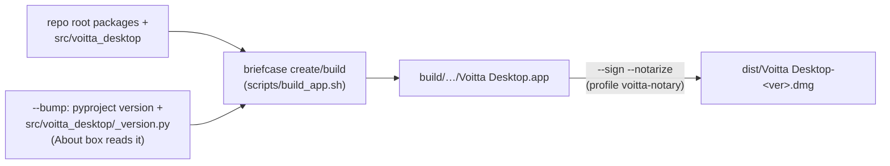

`scripts/build_app.sh` flags: `--clean`, `--bump`, `--package`, `--sign`,
`--notarize`. Dev runs never need any of this: `python app.py` from the venv
is the same code.

Note: the installed `/Applications/Voitta Desktop.app` runs its own bundled
copy of the sources — repo changes do not affect it until it is rebuilt.

---

## 16. Appendix: known issues

### Resolved

Each of these was a real, observed failure; the fix and its test are named
so the reasoning is recoverable.

| Was | Now |
|---|---|
| **MCP sessions destroyed under flaky network.** A cancelled `tools/list` made the SDK respond twice and assert; the `AssertionError` unwound the anyio TaskGroup and killed the session. | Cancellation propagates out of the gate so the SDK's own guard fires. [§8](#8-the-tool-gate), [tests](../tests/test_tool_gate_cancellation.py) |
| **The gate re-prompted forever.** No human answers inside a client's ~5 s timeout. | The popup outlives the request and publishes through `on_result`; the retry is served from cache. [§8](#8-the-tool-gate) |
| **`vt_object_store` was in-memory.** Restarting orphaned every `get_vt_object` placeholder in live sessions. | SQLite-backed, with disk fallback on read. [§6](#6-the-optimizer-pipeline), [tests](../tests/test_object_store.py) |
| **OAuth state was memory-only** — re-auth on every restart. | Refresh tokens in the Keychain, restored and refreshed at startup. [§10](#10-oauth-sign-in-and-token-refresh) |
| **Tracker required `X-Claude-Code-Session-Id`** and 502'd without it. | Falls back to a hash of the first user message. [tests](../tests/test_tracker_session_id.py) |
| **TUI arm/disarm raised `ImportError`** — it imported functions that did not exist. | `arm_claude_link`/`disarm_claude_link` added; the three open-coded copies of that sequence now call them. [tests](../tests/test_claude_link_and_config.py) |
| **`claude_link.armed` default disagreed** across three files. | One constant in [config.py](../config.py), default `False` (it edits a file we don't own). |
| **Three dotfile dirs, two spellings.** | One root, [paths.py](../paths.py), with non-destructive migration. [§14](#14-ports-paths--logging), [tests](../tests/test_paths_migration.py) |
| **A clean quit and a hard kill looked identical** in the log. | Signal/exception handlers plus an on-disk run marker. [§14](#14-ports-paths--logging) |
| **Four event loops, nine ad-hoc threads.** | One runtime. [§2](#2-process--thread-model), [tests](../tests/test_runtime.py) |
| **Eight hand-written `AppHelper.callAfter` sites** enforcing the main-thread rule. | One [`@on_main_thread`](../ui/main_thread.py) decorator. |

### Open

- **Why the process sometimes dies is not yet explained.** The MCP session
  crash above is fixed and proven, but it did not kill the *process* — and
  the process was also dying, silently, leaving orphaned subprocesses. The
  instrumentation in [§14](#14-ports-paths--logging) exists to attribute
  that; it needs a recurrence to report. Check `state/last_run.json` and
  grep `desktop.log` for `shutdown` or `DIED SILENTLY` after any unexpected
  restart. If peak RSS is climbing into the GBs, suspect the optimizer
  `json.loads`-ing multi-MB request bodies whole.
- **Live MCP add/remove** still needs a restart: the proxy mounts each
  server at startup with a closed-over client factory. Settings prompts for
  the restart rather than reloading.
- **`ENABLE_TOOL_SEARCH` is not removed on disarm.** Deliberate — we don't
  track whether we added it, and `true` is harmless when disconnected — but
  it does mean disarm is not a byte-exact undo.
- **The bundle is not signed or notarized.** The hardened-runtime
  entitlements in [pyproject.toml](../pyproject.toml) are not enforced.
- **MCP backends are not self-contained**: `uvx` (Homebrew) for Jira, `npx`
  (Node) for stdio servers, and a Google Workspace checkout whose default
  path is a developer's home directory.
- **Test coverage is now real but partial**: the runtime, object store,
  paths, tracker id, claude-link and gate cancellation are covered; the
  optimizer pipeline has its original cache-stability suite; the MCP proxy's
  mounting and auth injection remain untested.
