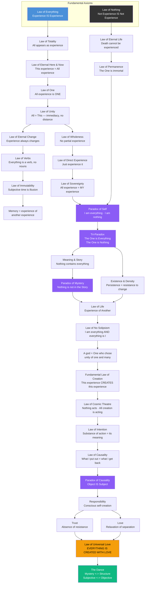

# Laws of Mystery — Logical Structure

Book by Aleksandr Bulkin (2026, Living Bridge Publishing)

```mermaid
graph TD
    subgraph "Fundamental Axioms"
        E["Law of Everything<br/>Experience IS Experience"]
        N["Law of Nothing<br/>Not Experience IS Not Experience"]
    end

    E --> PM["Law of Totality<br/>All appears as experience"]
    PM --> HN["Law of Eternal Here & Now<br/>This experience = All experience"]
    HN --> ONE["Law of One<br/>All experience is ONE"]
    ONE --> UNITY["Law of Unity<br/>All = This — immediacy, no distance"]

    UNITY --> CHANGE["Law of Eternal Change<br/>Experience always changes"]
    CHANGE --> VERBS["Law of Verbs<br/>Everything is a verb, no nouns"]
    VERBS --> IMMUT["Law of Immutability<br/>Subjective time is illusion"]
    IMMUT --> MEMORY["Memory = experience of<br/>another experience"]

    N --> LIFE_ETERNAL["Law of Eternal Life<br/>Death cannot be experienced"]
    LIFE_ETERNAL --> PERM["Law of Permanence<br/>The One is immortal"]

    UNITY --> WHOLE["Law of Wholeness<br/>No partial experience"]
    WHOLE --> DIRECT["Law of Direct Experience<br/>Just experience it"]

    DIRECT --> SOV["Law of Sovereignty<br/>All experience = MY experience"]
    SOV --> PARADOX_SELF["Paradox of Self<br/>I am everything · I am nothing"]
    PERM --> PARADOX_SELF

    PARADOX_SELF --> TRI["Tri-Paradox<br/>The One is Everything<br/>The One is Nothing"]

    TRI --> STORY["Meaning & Story<br/>Nothing contains everything"]
    STORY --> MYSTERY_P["Paradox of Mystery<br/>Nothing is not in the Story"]

    TRI --> EXIST["Existence & Density<br/>Persistence = resistance to change"]

    MYSTERY_P --> LIFE["Law of Life<br/>Experience of Another"]
    EXIST --> LIFE
    LIFE --> NOSOL["Law of No Solipsism<br/>I am everything AND everything is I"]

    NOSOL --> GOD["A god = One who chose<br/>unity of one and many"]
    GOD --> CREATE["Fundamental Law of Creation<br/>This experience CREATES this experience"]
    CREATE --> THEATRE["Law of Cosmic Theatre<br/>Nothing acts · All creation is acting"]

    THEATRE --> INTENT["Law of Intention<br/>Substance of action = its meaning"]
    INTENT --> CAUSAL["Law of Causality<br/>What I put out = what I get back"]
    CAUSAL --> PARADOX_C["Paradox of Causality<br/>Object IS Subject"]
    PARADOX_C --> RESP["Responsibility<br/>Conscious self-creation"]

    RESP --> TRUST["Trust<br/>Absence of resistance"]
    RESP --> LOVE["Love<br/>Relaxation of separation"]
    TRUST --> FINAL["Law of Universal Love<br/>EVERYTHING IS CREATED WITH LOVE"]
    LOVE --> FINAL

    FINAL --> DANCE["The Dance<br/>Mystery <-> Structure<br/>Subjective <-> Objective"]

    style E fill:#4a90d9,color:#fff
    style N fill:#333,color:#fff
    style TRI fill:#8b5cf6,color:#fff
    style FINAL fill:#f59e0b,color:#000
    style DANCE fill:#10b981,color:#fff
    style PARADOX_SELF fill:#8b5cf6,color:#fff
    style PARADOX_C fill:#8b5cf6,color:#fff
    style MYSTERY_P fill:#8b5cf6,color:#fff
```
